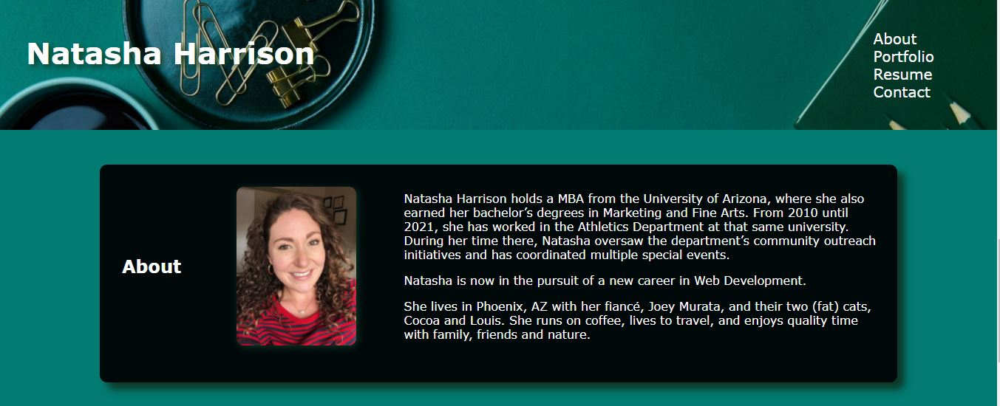

# Natasha Harrison Murata Portfolio

## Description

This project is a portfolio website used to showcase future projects and work I've done to other developers as well as potential employers.

I want this site to be a snapshot of my personality and work.

This is a working portfolio so new content will be added as it is developed.

Any remaining challenges for this page have been added the to the 'future task' list below.

Any and all feedback from users is appreciated!

## Built with

- This project was bootstrapped with [Create React App](https://github.com/facebook/create-react-app).
- Create React App

## Website

[GitHub](https://github.com/natasharrison/natasharrison_portfolio.git)

[deployed](https://natasharrison.github.io/natasharrison_portfolio/)

## Credit

- Natasha Harrison Murata [@natasharrison](https://github.com/natasharrison)